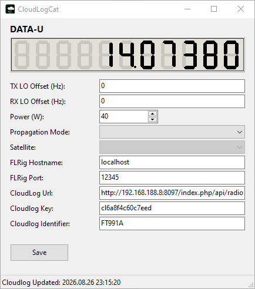

# CloudLogCat (Lazarus/FPC)

Lazarus/Free Pascal-Portierung von [CloudLogCatQt](https://github.com/myzinsky/CloudLogCatQt)
(Original von Matthias Jung, DL9MJ, BSD-3-Clause-Lizenz).



Funktional identisch zum Original:

- Fragt **FLRig** einmal pro Sekunde per XML-RPC-artigem HTTP-POST nach VFO-Frequenz,
  Betriebsart und Sendeleistung ab.
- Lädt Änderungen als JSON per HTTP-POST zu **CloudLog** hoch.
- Unterstützt TX-/RX-Oszillator-Offsets (Transverter), Propagationsmodus,
  Satellitenauswahl (`sat.dat`) und die CloudLog-Instanz-Kennung.
- Speichert Einstellungen in `settings.ini` neben der exe – gleiches
  Ini-Format wie die Qt-Version (Sektion `[General]`), eine vorhandene
  `settings.ini` der Qt-App kann direkt weiterverwendet werden.

## Architektur-Unterschiede zur Qt-Version

- **HTTP:** `QNetworkAccessManager` (asynchron) → eigener `TPollThread`
  (`uPollThread.pas`), der per `TFPHTTPClient` synchron pollt und Ergebnisse
  per `Synchronize` an die GUI meldet. Die Oberfläche blockiert dadurch nie.
- **Frequenzanzeige:** Die LCL hat kein `QLCDNumber`-Äquivalent. Ersetzt durch
  ein `TLabel` in großer, fetter Monospace-Schrift auf schwarzem Grund
  (`lblFrequency` in `pnlFrequency`).
- **JSON:** Aufbau über `fpjson` (`TJSONObject`) statt manueller
  String-Konkatenation – vermeidet fehlerhaftes JSON, falls z. B. die
  CloudLog-Identifier ein Anführungszeichen enthält.
- **Dezimaltrennzeichen:** FLRig/CloudLog erwarten immer `.` als
  Dezimaltrennzeichen (wie Qt es lokalisierungsunabhängig handhabt) –
  im Code über ein festes `TFormatSettings` sichergestellt, unabhängig von
  der Windows-Locale.

## Projektdateien

| Datei | Zweck |
|---|---|
| `CloudLogCat.lpi` | Lazarus-Projekt (Build-Modi „Win32“ und „Win64“) |
| `CloudLogCat.lpr` | Programmeinstieg |
| `uMain.pas` / `uMain.lfm` | Hauptformular |
| `uPollThread.pas` | Hintergrund-Thread für FLRig-Polling & CloudLog-Upload |
| `sat.dat` | Satellitenliste (muss neben der exe liegen) |

## Build

Benötigt [Lazarus](https://www.lazarus-ide.org/) (empfohlen: aktuelle Version,
FPC ≥ 3.2.2).

### Windows (64-Bit)

```bash
lazbuild --build-mode=Win64 CloudLogCat.lpi
```

Oder in der IDE: `CloudLogCat.lpi` öffnen, Build-Modus **Win64** wählen,
`Strg+F9`.

### Windows (32-Bit)

Voraussetzung: Cross-Compiler `i386-win32` ist installiert (Lazarus
Online-Package-Manager → „Cross compilers“, oder `fpcupdeluxe`).

```bash
lazbuild --build-mode=Win32 CloudLogCat.lpi
```

### Linux / macOS

Die App ist weiterhin plattformunabhängig gehalten (LCL wählt automatisch
das passende Widgetset). Unter Linux/macOS direkt mit dem dortigen Lazarus
öffnen und bauen, oder per Cross-Compiler:

```bash
lazbuild --os=linux --cpu=x86_64 CloudLogCat.lpi
lazbuild --os=darwin --cpu=x86_64 CloudLogCat.lpi
```

### Wichtig: HTTPS zu CloudLog

`TFPHTTPClient` nutzt für `https://`-URLs OpenSSL. Unter Windows müssen die
passenden OpenSSL-DLLs (zur jeweiligen Bitness!) neben der exe liegen, z. B.:

- OpenSSL 1.1.x: `libssl-1_1.dll` + `libcrypto-1_1.dll` (32-Bit) bzw.
  `libssl-1_1-x64.dll` + `libcrypto-1_1-x64.dll` (64-Bit)

Unter Linux/macOS ist OpenSSL i. d. R. bereits Systembestandteil.

## Einstellungen

Wie im Original: CloudLog-URL (z. B.
`https://<CloudLogServer>/index.php/api/radio`) und API-Key eintragen,
FLRig-Verbindung (Standard `localhost:12345`), optional TX-/RX-Oszillator-
Offset, Ausgangsleistung, Propagationsmodus und – für SAT-QSOs – den
Satellitennamen (aus `sat.dat`, muss im exe-Verzeichnis liegen). Mit
„Save“ werden die Einstellungen in `settings.ini` gespeichert.
