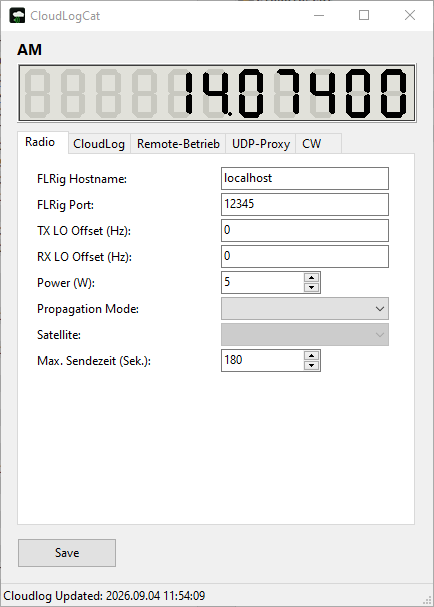
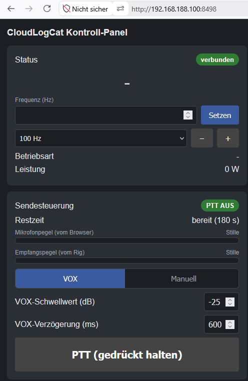
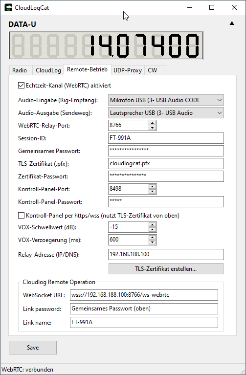

CloudLogCat - User Guide
=========================

CloudLogCat connects FLRig to CloudLog. It reads the current rig state and
reports it to CloudLog without blocking the desktop application. Settings are
stored in settings.ini next to the executable when you press Save.

FEATURES
--------

Radio and CloudLog integration
* Polls FLRig once per second for VFO frequency, mode, and transmit power.
* Sends changed radio data to the configured CloudLog Radio API endpoint.
* Supports separate TX and RX LO offsets for transverters.
* Supports propagation mode and satellite selection. The satellite list is
  read from sat.dat beside the executable.
* Accepts pending CloudLog radio commands and forwards supported commands to
  FLRig: frequency, mode, VFO, power, and PTT.
* Uses a PTT safety timeout. When it expires, CloudLogCat sends PTT OFF and
  locks further PTT-on requests until an explicit PTT-off request is received.

Optional remote-operation features
* WebRTC audio bridge for CloudLog Remote Operation.
* WebRTC data channel support for radio-control commands offered by the
  remote browser.
* VOX operation from the incoming browser microphone audio.
* Optional TLS for WebRTC signalling and for the local Control Panel.

Other optional features
* WSJT-X-compatible UDP proxy. It forwards all incoming UDP datagrams and
  can send Logged ADIF QSOs to CloudLog automatically.
* K1EL WinKeyer support through a Windows COM port for sending CW text.
* Optional debug.log for diagnosing CloudLog, FLRig, WebRTC, TLS, audio, and
  control-panel issues.

INITIAL CONFIGURATION
---------------------

1. Prepare FLRig

   Start FLRig and enable its XML-RPC server. The normal local endpoint is:

       Host: localhost
       Port: 12345

   In CloudLogCat, open the Radio tab and enter the FLRig hostname and port.
   Use the IP address or host name of the FLRig computer when FLRig runs on a
   different machine.

2. Configure basic radio reporting

   On the Radio tab:

   * Enter TX LO Offset and RX LO Offset only when a transverter or other
     frequency conversion requires them. Leave both at 0 for a direct rig.
   * Select the propagation mode used for the current operation.
   * Select a satellite when the propagation mode is SAT. Ensure sat.dat is
     present beside CloudLogCat.exe.
   * Set Max. transmit time in seconds. A value of 0 disables the timeout;
     a non-zero value is strongly recommended for any remote PTT operation.

3. Configure CloudLog

   Open the CloudLog tab and enter:

   * CloudLog URL: the Radio API URL, for example
     https://your-cloudlog-server/index.php/api/radio
   * CloudLog Key: the API key for the station/account.
   * CloudLog Identifier: a unique, recognizable name for this CloudLogCat
     instance. CloudLog uses this name when it addresses radio commands.

   Press Save. CloudLogCat starts polling FLRig and uploads frequency, mode,
   and power as they change. The current values are displayed in the main
   window.

4. Confirm operation

   Change frequency, mode, or power in FLRig and wait up to one poll interval
   (about one second). Confirm that the values appear in CloudLog. If they do
   not, enable "Write debug log (debug.log)" on the CloudLog tab, press Save,
   and inspect debug.log beside the executable.

REMOTE OPERATION (OPTIONAL)
---------------------------

The Remote Operation tab configures the local WebRTC shack endpoint. Leave
the WebRTC feature disabled if you only need normal FLRig-to-CloudLog radio
reporting and CloudLog command polling.

To configure WebRTC:

1. Enable the WebRTC real-time channel.
2. Select the audio capture device carrying rig receive audio.
3. Select the audio playback device feeding the transmit audio path.
4. Set a relay port (default: 8765).
5. Enter a Session ID and a shared password. They must match the corresponding
   Remote Operation configuration in CloudLog. Use a strong shared password
   of at least 16 characters.
6. Configure VOX threshold and hang time as needed. The default threshold is
   -30 dBFS and the default hang time is 500 ms. Lower threshold values are
   more sensitive.
7. Press Save.

If CloudLog is served over HTTPS, browsers normally require secure WebSocket
connections for its remote-operation page. In that case configure a PFX/PKCS#12
TLS certificate and password in CloudLogCat, and configure CloudLog to use the
matching WSS relay address. A browser must trust a self-signed certificate
before it can open a WSS connection to the relay.

The WebRTC runtime DLLs must be available next to CloudLogCat.exe for this
optional feature: datachannel.dll, opus.dll and their supplied dependencies.
Without them, the normal CloudLog/FLRig functionality remains available but
the WebRTC channel cannot operate.

CONTROL PANEL
-------------

The Control Panel is a small, password-protected browser interface served
directly by CloudLogCat. It is independent of CloudLog Remote Operation and
is useful on the local network for monitoring and basic rig control.

Enable it

1. Open the Remote Operation tab.
2. Set Control Panel Port to an unused TCP port. Port 0 disables the panel.
3. Set a non-empty, strong Control Panel Password.
4. Press Save.
5. Open the following address from an authorized browser:

       http://<shack-computer-IP>:<control-panel-port>/

6. Enter the Control Panel password.

For example, when the shack computer IP is 192.168.1.50 and the panel port is
8080, open:

       http://192.168.1.50:8080/

TLS for the Control Panel

Enable "Control Panel via https/wss" to use HTTPS and WSS. This reuses the
PFX certificate and certificate password configured above for WebRTC. Open
the panel with https:// instead of http://. The browser must trust the
certificate, especially when it is self-signed.

Control Panel functions

* Displays the current frequency, mode, and power reported by FLRig.
* Displays PTT state, PTT reason, configured timeout, and remaining transmit
  time while transmitting.
* Changes frequency through FLRig.
* Provides a hold-to-talk PTT button. Release the button to request PTT OFF.
  The same safety timeout and post-timeout lockout used by all other PTT paths
  are enforced here.
* Switches between VOX and manual operation for the WebRTC audio bridge.
  Switching VOX off also requests PTT OFF, preventing a stale VOX transmit
  state.
* Displays live microphone and rig-receive audio level meters when the WebRTC
  audio bridge is active.
* Lets an authorized user change VOX threshold and hang time. These values are
  mirrored into the main window and saved in settings.ini.

Security notes

* A Control Panel is disabled unless both a port and a password are set.
* Authentication is required before the panel exposes status or accepts
  commands.
* Do not expose an HTTP Control Panel directly to the public Internet.
  Use HTTPS/WSS, a VPN, or a trusted private network for remote access.
* Treat the Control Panel password, CloudLog API key, WebRTC shared password,
  and PFX password as secrets. Do not include them in screenshots or logs.

UDP PROXY (OPTIONAL)
--------------------

The UDP Proxy tab can receive WSJT-X-compatible UDP traffic from WSJT-X,
JTDX, MSHV, GridTracker, and similar applications.

* Enable the UDP proxy and choose a listen port.
* Optionally enter a forwarding host and port. Leave them empty or 0 to use
  CloudLog QSO logging without forwarding.
* Click Load station profiles, choose the CloudLog station profile, and press
  Save.
* Logged ADIF messages are sent to CloudLog's QSO API. Other UDP messages are
  forwarded unchanged when forwarding is configured.

CW / WINKEYER (OPTIONAL)
------------------------

On the CW tab, select or type the WinKeyer COM port, set the desired speed in
WPM, and click Connect. Enter printable ASCII text and click Send to key it.
Use Abort to stop queued or active CW text. Disconnect the WinKeyer before
unplugging or changing its COM-port assignment.

SETTINGS, LOGS, AND TROUBLESHOOTING
-----------------------------------

* Press Save after changing settings. The file settings.ini is created or
  updated beside CloudLogCat.exe.
* debug.log is created only after debug logging is enabled and saved.
* If CloudLog data does not update, first confirm FLRig is running and the
  hostname/port are correct. Then verify the CloudLog URL and API key.
* If a power value remains unchanged, verify FLRig itself reports a current
  power value. CloudLogCat accepts XML-RPC integer and decimal power replies.
* If the Control Panel cannot be opened, check its port, password, Windows
  Firewall rules, and whether another program is already using the port.
* If WebRTC does not connect, verify the session ID, shared password, relay
  port, TLS certificate/trust, selected audio devices, and required DLLs.
* On exit, CloudLogCat requests PTT OFF if the rig is currently keyed.

SUPPORTED PLATFORM
------------------

CloudLogCat is a Windows application. It is built for Win32 and Win64.
